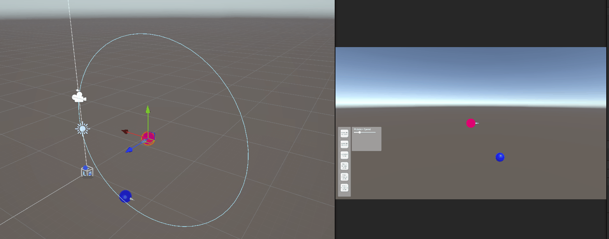

# Take Home Task

In this project I was tasked with developing a series of small demos consisting of procedural 3D mesh generation, animation, interaction with optional VR integration.

# Project Video Demonstration
[VR Implementation- Youtube](https://www.youtube.com/watch?v=vpM1LpFZr8U)

[Non-VR Implementation- Youtube](https://www.youtube.com/watch?v=CG_MMXy7GYk)


# Setup Instructions

1. Clone the repo:
   ```bash
   git clone https://github.com/Rbocarro/VR_TakeHome_RB

   ```
2. Open the project in Unity **6000.0.33f1** or later with URP enabled
3. If there are any package dependency issues, Ensure the [Unity VR Featureset](https://docs.unity3d.com/6000.0/Documentation/Manual/VRFeature.html) is installed from Package Manager > Unity Registry > VR, and click install. This should install the XR Interaction Toolkit, OpenXR plugin, Oculus XR Plugin and any other related dependancies.
4. To Try the non VR demo Load the scene in: Assets/Scenes/DemoScene.unity
5. To Try the  VR demo Load the scene in: Assets/Scenes/DemoScene_VR.unity
5. Ensure a Compatible Quest VR headset and controllers are connected when playtesting the VR Scene.

> [!IMPORTANT]
> There may be an Error message(Unable to start Oculus XR Plugin) when attempting to playtest the Non VR scene or attempting to playtest the VR scene without a headset connected. This message can be ingnored when playtesting the Non VR scene as the headset is not required. For playtesting the VR scene, please ensure a compatible headset is connected.

# Implementation

This project was built in Unity 6 using URP with the Occulus XR plugin and XR interaction toolkit which comes with an XR rig prefab.
The core functionality consists of a DemoManager component attached to the XR rig which controls all of the individual demo components using coroutines or toggling individual components when needed. VR interactions were tested using an Occulus Quest 2. Parameters of each indivdual demo can be tweaked either in the Inspector at the DemoManager component or using the UI panel attached to the left controller.

## Procedural Mesh Creation
This script procedurally generates a UV sphere gameobject(Object A) and a cone mesh as its child pointing in the forward direction. It creates vertices and triangles based on configurable parameters found in the inspector such as resolution and size and assigns it a red material.

#### References used:
https://danielsieger.com/blog/2021/03/27/generating-spheres.html

https://catlikecoding.com/unity/tutorials/procedural-meshes/cube-sphere/

https://www.youtube.com/watch?v=6xs0Saff940

## Secondary Object
This similarly procedurally generates a UV sphere mesh(Object B) and a cone mesh as its child pointing in the forward direction and assigns it a blue material.

## Lissajous Animation

This was implmented by creating a LissajousMovement script attached to a gameobject which animates it along different types of Lissajous and parametric curves such as the standard Lissajous formula, Heart and Butterfly by adjusting values such as amplitudes, frequencies and phase shift using the UI panel attached to the Left controller. some of the UI fucntionality for this was moved to the LissajousUIBindings class which helped with deculttering the main DemoManager class.

#### References used:
https://www.intmath.com/trigonometric-graphs/7-lissajous-figures.php


## Object Rotation

This was implemented by randomly placing Object B around object A along a given radius. Object A then smoothly rotates object A to face object B using a difference vector and Quaternion.RotateTowards() and an angularSpeed muitiplier. Once Object A is within a treshhold, Object B moves to a diffrent positon around object A. The angular speed can be controlled using the UI slider attached to the Left controller.


## Color Change Based on Angle

This script takes the dot product of the forward vector of object A and and the direction from it to object B which orbits around A. This is then sent to an simple unlit HLSL shader wich interpolates the color in the fragment shader. there were some rendering issues when writing this shader related to URP and how it handels single and multi pass instancing.This was remedied by adding some macros to the shader. the rotation speed can be controlled using the UI slider attached to the Left controller.

#### References used:
+ https://www.youtube.com/watch?v=JiCJN8EvoCA
+ https://docs.unity3d.com/Manual/SinglePassInstancing.html

## Mesh Vertex Animation

This script get reference to the mesh componet of and displaces its vertices using unity's Mathf.PerlinNoise() function with controllable parameters such as noise scale, displacement and scroll speed using using the UI sliders attached to the Left controller. A simple Fresnel shader is applied to the mesh to improve visibility.

## VR integration

This script allows VR object attraction toward the user's left and right controllers within a defined radius. The user can use UI sliders to control the attraction force which allows it to smoothly or quickly interpolates object positions toward the controllers using Vector3.Lerp(). Addtionally, each demo postions the demo objects infront of the VR camera's forward vector.

## Improvements
If given more time, This project could benefit from improvements such as cleaning up code structure to improve readability and better compartmentalised functions.

+ The Procedural mesh generation only generates a UV sphere mesh which has uneven vetex distribution near the poles. there are other sphere apporximation meshes such as Icospheres and Cube spheres that can be implemented.
+ The vetrex displacement can be implmented in a vertex shader which can offload the calculations to the GPU allowing for better perfromance. Additionally Using a precalculated Perlin Noise texture can also allow for a performance improvement especially on VR devices.


